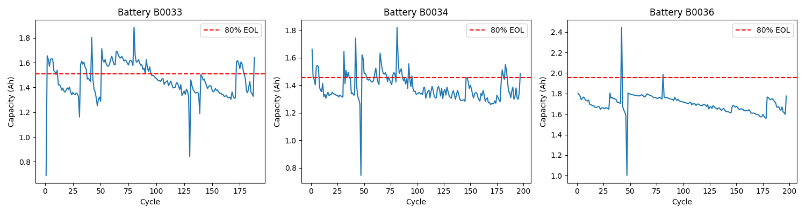

# 🔋 EV Battery Degradation Predictor

Real-time State of Health (SoH) and Remaining Useful Life (RUL) prediction 
for lithium-ion batteries using an LSTM neural network trained on NASA battery data.

Built as a production-style ML system with a REST API and live monitoring dashboard.

---

## Demo



---

## Results

| Metric | Value |
|--------|-------|
| Test MAE | 0.1303 Ah |
| Test RMSE | 0.1569 Ah |
| Test MAPE | **8.36%** |
| Generalization | Trained on B0033/B0034/B0036 → tested on B0005/B0006/B0007 |

Cross-battery generalization means the model predicts degradation on 
**batteries it has never seen** — the same challenge in real EV fleets.

---

## Architecture
```
Raw discharge CSVs (NASA)
        ↓
Feature extraction (12 features per cycle)
        ↓
2-layer LSTM (seq_len=10 cycles)
        ↓
FastAPI REST endpoint (/predict)
        ↓
Streamlit real-time dashboard
```

## Features Engineered Per Cycle

| Feature | Why it matters |
|---------|----------------|
| voltage_mean / min / std | Voltage profile shape indicates cell health |
| voltage_drop | Terminal voltage drop = internal resistance proxy |
| voltage_slope | Rate of decline correlates with capacity fade |
| temp_mean / max / rise | Thermal stress accelerates degradation |
| current_mean / std | Load consistency affects cycle life |
| discharge_time | Shorter discharge = less usable energy |
| internal_resistance_proxy | ΔV/ΔI — key indicator of aging |

---

## Stack

- **Model:** PyTorch LSTM (2 layers, hidden=64, dropout=0.2)
- **API:** FastAPI + Uvicorn
- **Dashboard:** Streamlit + Plotly
- **Data:** NASA Li-ion Battery Aging Dataset (patrickfleith/nasa-battery-dataset)

---

## Run It
```bash
# 1. Install
python3 -m venv venv && source venv/bin/activate
pip install pandas numpy scikit-learn torch fastapi uvicorn streamlit plotly joblib kagglehub

# 2. Download data + build features
python3 download_data.py
python3 features.py

# 3. Train model
python3 train.py

# 4. Start API
python3 api.py

# 5. Launch dashboard (new terminal)
streamlit run dashboard.py
```

## API Usage
```bash
POST /predict
Content-Type: application/json

{
  "battery_id": "B0005",
  "cycles": [ ...10 cycle feature objects... ]
}
```

Response:
```json
{
  "battery_id": "B0005",
  "predicted_capacity": 1.4536,
  "state_of_health_pct": 72.68,
  "rul_estimate": "Warning — recommend service inspection",
  "warning": "⚠️ Below 80% SoH — EOL threshold crossed"
}
```
